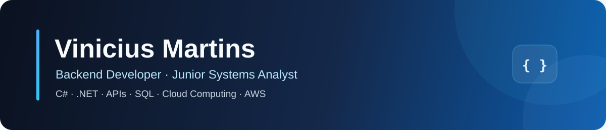

  

  Backend-focused software developer building and evolving business applications with C#, .NET, SQL, and cloud technologies.

  
  

## About Me

I'm a Junior Systems Analyst at Rede Bandeirantes and a Computer Engineering graduate, currently pursuing a postgraduate degree in Cloud Computing.

My day-to-day work includes developing and maintaining internal applications, writing SQL queries and stored procedures, troubleshooting production issues, automating repetitive processes, and improving existing systems. I'm building my career around backend development with C# and .NET, software architecture, APIs, cloud computing, and AWS.

## Tech Stack

**Backend**

**Data, frontend, and tools**

## Featured Projects

| Project | What it demonstrates | Main technologies |
| --- | --- | --- |
| [SalesWeb MVC](https://github.com/ViniMartins10/SalesWeb) | An ASP.NET Core MVC application with asynchronous CRUD operations, data persistence, migrations, and server-rendered views. | C#, .NET 8, ASP.NET Core MVC, EF Core, MySQL |
| [Safe Fall](https://github.com/ViniMartins10/safe_fall_app) | An academic fall-detection solution designed around mobile computer vision, smartwatch sensors, and automated alerts. | Flutter, Dart, Wear OS, Kotlin, ML Kit, device sensors |
| [Intelligent Route Optimization](https://github.com/ViniMartins10/rota-inteligente) | Delivery-zone clustering and route optimization using graphs, heuristics, and measurable output. | Python, NetworkX, scikit-learn, Pandas, Matplotlib |
| [React + Node User Management](https://github.com/ViniMartins10/react-node) | A full-stack CRUD application with a REST API, relational persistence, and environment-based configuration. | React, Node.js, Express, MySQL |

> The Safe Fall repository currently presents the project documentation. Its mobile and Wear OS source modules are being organized for publication.

## GitHub Stats

Language statistics reflect public repository usage and do not represent skill level.

Language statistics reflect public repository usage and do not represent skill level.

## Currently Learning

- Cloud architecture and AWS services
- Backend architecture, design patterns, and API design with .NET
- Containers, CI/CD, observability, and application deployment

## Contact

I'm open to connecting with recruiters, backend developers, and cloud professionals. If you would like to discuss .NET, software architecture, AWS, or an opportunity, feel free to reach out on [LinkedIn](https://www.linkedin.com/in/vinicius-martins2004/) or explore my repositories here on GitHub.
